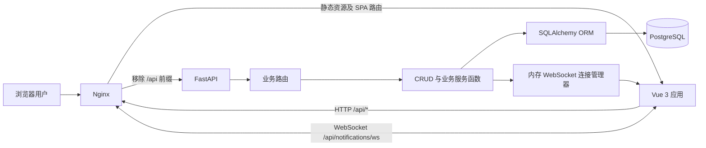
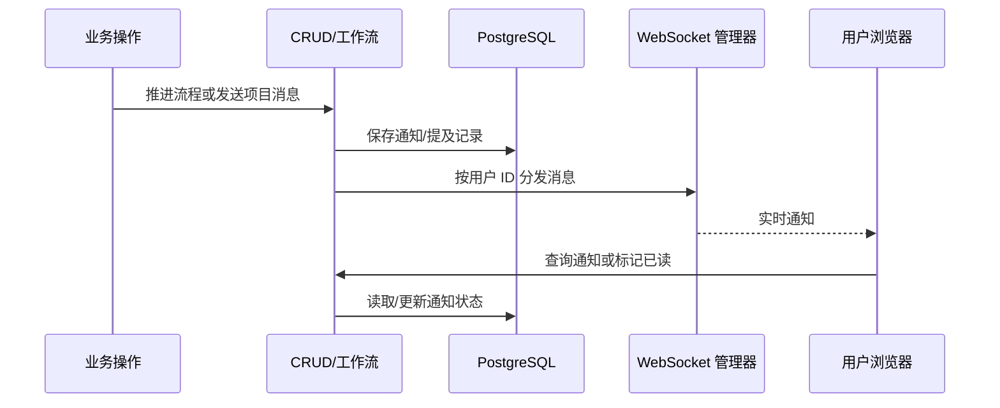

# 新石业务管理系统架构说明

> 本文描述仓库截至 2026-07-28 的实际架构，用于帮助开发者快速理解系统边界、主要模块、数据流和部署方式。  
> 本文不是需求说明，也不替代 API 文档、数据库迁移记录或具体业务规则文档。

## 1. 系统概览

本项目是面向翻译业务的内部管理系统，覆盖用户与角色、客户与咨询、翻译项目、子订单、项目工作流、译员资源、排班请假、项目文件、项目沟通、通知和财务等业务。

系统采用前后端分离的单体架构：

- 前端：Vue 3 单页应用，通过 Axios 访问 `/api`。
- 后端：FastAPI 单体服务，按业务域拆分路由。
- 数据库：PostgreSQL，使用 SQLAlchemy ORM 同步访问。
- 实时通信：FastAPI WebSocket，用于个人通知推送。
- 入口代理：生产环境由 Nginx 托管前端静态资源并反向代理 API 与 WebSocket。



## 2. 技术栈

| 层次 | 主要技术 | 作用 |
| --- | --- | --- |
| Web 前端 | Vue 3、Vue Router 4 | 单页应用、页面与路由 |
| UI | Element Plus | 表单、表格、弹窗等界面组件 |
| HTTP 客户端 | Axios | API 调用、Bearer Token 注入、统一错误处理 |
| 构建工具 | Vite 5 | 本地开发、代理和生产构建 |
| Web API | FastAPI、Uvicorn | REST API、依赖注入、WebSocket |
| 数据访问 | SQLAlchemy 2、psycopg2 | ORM 与 PostgreSQL 驱动 |
| 数据校验 | Pydantic 2 | 请求和响应模型 |
| 认证 | JWT、Passlib、bcrypt | 登录、Token 验证和密码散列 |
| 数据库 | PostgreSQL 17 | 业务数据持久化 |
| 部署 | Docker Compose、Nginx | 服务编排、静态资源和反向代理 |

## 3. 仓库结构

```text
xinshi_system/
├── main.py                     # FastAPI 应用入口、路由注册、启动检查
├── database.py                 # 数据库连接、Session 工厂及依赖
├── models.py                   # 主要业务 ORM 模型
├── schemas.py                  # 主要业务 Pydantic 模型
├── crud.py                     # 通用及主要业务数据访问函数
├── workflow_models.py          # 工作流实例与日志模型
├── workflow_schemas.py         # 工作流请求/响应模型
├── workflow_crud.py            # 工作流规则、流转及任务查询
├── project_chat_crud.py        # 项目沟通业务与数据访问
├── notification_ws.py          # WebSocket 连接和消息分发
├── routers/                    # 按业务域划分的 FastAPI 路由
├── frontend/
│   ├── src/api/                # 前端 API 适配层
│   ├── src/components/         # 跨页面组件
│   ├── src/composables/        # 可复用组合式逻辑
│   ├── src/layout/             # 主布局
│   ├── src/router/             # 页面路由和前端权限守卫
│   ├── src/views/              # 按业务域组织的页面
│   └── src/utils/              # 前端权限等工具
├── data/migrations/            # 增量 SQL 迁移脚本（当前数量较少）
├── migrate_*.py                # 历史数据或结构迁移脚本
├── docs/                       # 业务分析、优化及发布说明
├── tools/                      # 本地辅助工具
├── docker-compose.yml          # PostgreSQL、后端、前端编排
├── Dockerfile                  # 后端镜像
└── frontend/Dockerfile         # 前端构建及 Nginx 镜像
```

`backups/`、数据库导出文件、检查输出及本地虚拟环境属于运行或运维产物，不应作为应用架构依赖。

## 4. 后端架构

### 4.1 分层与依赖方向

当前后端是轻量分层单体，主要调用方向如下：

```text
main.py
  └─ routers/*
       ├─ schemas.py / workflow_schemas.py
       ├─ crud.py / workflow_crud.py / project_chat_crud.py
       ├─ models.py / workflow_models.py（部分路由会直接访问 ORM）
       └─ database.py
             └─ PostgreSQL
```

各层职责：

- `main.py`：创建应用、配置 CORS、注册路由、执行启动期表/字段检查。
- `routers/`：处理 HTTP 参数、认证依赖、状态码及响应结构。
- `schemas.py`、`workflow_schemas.py`：定义 API 输入输出契约。
- `crud.py`、`workflow_crud.py`、`project_chat_crud.py`：数据读写和业务编排。
- `models.py`、`workflow_models.py`：数据库表、字段和关系。
- `database.py`：创建 Engine 和请求级 Session。

这不是严格的领域驱动架构：部分复杂逻辑仍位于路由或大型 CRUD 文件中，路由也可能直接查询 ORM。新增复杂业务时，宜先提取独立业务服务，再由路由调用。

### 4.2 API 业务域

| 路由前缀 | 模块 | 主要职责 |
| --- | --- | --- |
| `/auth` | `routers/auth.py` | 登录、JWT 签发和当前用户解析 |
| `/users`、`/roles`、`/user-roles` | 用户权限 | 用户、角色及多对多关联 |
| `/clients`、`/client-contacts` | 客户 | 客户、子客户、联系人及回复 |
| `/consultations` | 咨询 | 商机/咨询管理及咨询转项目 |
| `/projects/translation` | 翻译项目 | 母订单及项目基本信息 |
| `/sub-orders` | 子订单 | 项目拆单及子订单管理 |
| `/workflow` | 工作流 | 初始化、难度设置、推进、回退、阶段数据及我的任务 |
| `/project-files` | 项目文件 | 文件记录及各阶段文件路径 |
| `/project-chat` | 项目沟通 | 项目聊天开关、消息和提及 |
| `/notifications` | 通知 | 通知查询、已读状态和 WebSocket |
| `/translators` | 译员资源 | 译员资料维护 |
| `/schedules`、`/leave` | 人员计划 | 员工排班、译员可用性和请假 |
| `/finance` | 财务 | 项目财务记录及收付款 |

除登录及 WebSocket 握手等特殊入口外，业务路由通常通过 `get_current_user` 依赖要求 Bearer Token。

### 4.3 认证与权限

认证流程：

1. 前端向 `/auth/login/json` 提交用户名和密码。
2. 后端验证密码，并将旧 SHA-256 密码散列按登录时机升级为 bcrypt。
3. 后端签发 HS256 JWT，载荷包含用户名和用户 ID。
4. 前端将 Token 和角色信息保存到 `localStorage`。
5. Axios 请求拦截器附加 `Authorization: Bearer <token>`。
6. 后端路由依赖解析 Token 并查询有效用户。

权限采用 RBAC（基于角色的访问控制），关系如下：

```text
用户 AppUser
  → 用户角色 UserRole
  → 角色 Role
  → 角色权限 RolePermission
  → 稳定权限编码（例如 projects:read、projects:write）
```

- 登录响应包含角色和合并后的权限编码，前端保存后用于路由、菜单和按钮展示。
- 后端通过 `require_permission` 或 `require_module_access` 强制执行权限。
- 查看与写入权限分离，例如 `finance:read` 和 `finance:write`。
- `admin`、`超级管理员`固定解析为通配权限 `*`，不需要逐项配置。
- 工作流阶段仍可叠加负责人和业务角色规则，这些属于业务授权而非菜单权限。

前端权限只能改善交互，不能作为安全边界；所有敏感操作都必须在后端校验权限。

### 4.4 核心工作流

翻译项目和子订单分别拥有工作流实例，但复用相同阶段定义和流转逻辑。主要阶段为：

```text
客户专员
  → 排版指派（文件不可编辑时）
  → 项目经理
  → 项目专员
  → 项目助理
  → 译审
  → 专检
  → 排版
  → 完成
```

实际阶段会依据项目难度和文件是否可编辑进行裁剪：

- `simple`：跳过项目经理、项目专员和译审。
- `normal`：跳过译审。
- 其他/复杂：保留完整业务阶段。
- 文件可编辑时：跳过排版指派。

工作流推进会更新实例及日志，并可能联动待办、财务记录和通知。详细业务规则参见 [`docs/项目业务与逻辑框架分析.md`](docs/项目业务与逻辑框架分析.md)。

### 4.5 数据模型分组

| 分组 | 主要模型 |
| --- | --- |
| 身份权限 | `AppUser`、`Role`、`UserRole`、`RolePermission` |
| 客户商机 | `Client`、`SubClient`、`ClientContact`、`Consultation` |
| 项目交付 | `TranslationProject`、`TranslationSubOrder`、`ProjectFile` |
| 工作流 | `WorkflowInstance`、`WorkflowLog` |
| 资源计划 | `Translator`、`TranslatorSchedule`、`WorkSchedule`、`EmployeeLeave` |
| 协作通知 | `ChatProjectEnabled`、`ChatProjectMessage`、`ChatProjectMention`、`AppNotification` |
| 财务 | `FinanceRecord`、`FinancePayment` |

数据库会话采用请求级同步 Session：依赖函数在请求进入时创建 Session，并在请求结束时关闭。

### 4.6 通知链路



当前连接管理器保存在后端进程内存中，因此默认适合单后端进程。若部署多个后端实例，需要引入 Redis Pub/Sub 等跨实例消息通道，并考虑共享连接路由。

## 5. 前端架构

前端采用以业务页面为中心的组织方式：

- `views/`：按项目、客户、资源、排班、财务、系统等业务域分组。
- `api/`：封装后端端点，页面不直接拼接通用 Axios 配置。
- `components/`：通知铃铛、项目聊天等跨页面组件。
- `composables/`：工作流和实体选择器等可复用状态逻辑。
- `router/index.js`：路由注册、懒加载、登录检查和角色守卫。
- `layout/index.vue`：登录后的主框架和导航。

数据请求链路如下：

```text
Vue 页面/组件
  → src/api/<业务模块>.js
  → src/api/index.js（Axios 实例）
  → /api/*
  → Vite 开发代理或 Nginx 生产代理
  → FastAPI
```

Axios 响应拦截器直接返回 `response.data`；遇到 401 时会清除本地登录信息并跳转到登录页。项目、子订单和聊天等部分模块会在 API 适配层转换 `camelCase` 与 `snake_case`。

## 6. 关键业务数据流

### 6.1 咨询转翻译项目

```text
创建/跟进咨询
  → 咨询成交
  → 创建翻译项目
  → 生成订单号
  → 初始化工作流
  → 分派并逐阶段流转
  → 项目完成
  → 财务、通知及项目沟通
```

### 6.2 母订单与子订单

- `TranslationProject` 是对客户的母订单。
- 项目可拆分为多个 `TranslationSubOrder`。
- 母订单和子订单都可独立维护工作流实例。
- 文件、排班、译员资源和财务围绕项目交付过程协同。

## 7. 运行与部署

### 7.1 本地开发

- 后端默认由 Uvicorn 在 `8000` 端口提供服务。
- 前端 Vite 默认在 `3000` 端口提供服务。
- Vite 将 `/api` 请求代理到后端并移除 `/api` 前缀。
- 数据库连接由 `.env` 中的 `DB_*` 或 `DATABASE_URL` 配置。

本地代理目标目前写有固定局域网 IP。若开发环境发生变化，应改为环境变量或稳定的本机默认值，避免每位开发者修改受版本控制的配置。

### 7.2 Docker Compose

Compose 启动三个服务：

```text
frontend:8080
  └─ Nginx → backend:8000
                    └─ postgres:5432
```

- `postgres`：PostgreSQL 17，使用命名卷 `pgdata`。
- `backend`：Python 3.11 + Uvicorn。
- `frontend`：构建 Vue 静态资源，并由 Nginx 提供服务。
- Nginx 对 `/api/*` 移除 `/api` 前缀后转发给 FastAPI。
- `/api/notifications/ws` 保留 WebSocket Upgrade 头并单独代理。

## 8. 已知架构约束与风险

以下内容是对当前仓库的客观检查结果，按优先级建议逐步治理：

1. **敏感配置管理**：数据库默认密码和 Compose 配置中存在明文凭据。生产环境应通过独立环境文件或密钥管理服务注入，仓库只保留 `.env.example`。
2. **数据库迁移不统一**：启动过程会创建部分表并执行 `ALTER TABLE`，同时仓库中还存在 SQL 和 Python 迁移脚本。建议统一使用 Alembic，应用启动只做连接/版本检查，不修改结构。
3. **CORS 范围过宽**：后端当前允许所有来源。生产环境应配置明确的可信域名列表。
4. **服务边界偏弱**：`crud.py`、`models.py`、`schemas.py` 体积较大，部分路由直接访问 ORM。业务继续增长时，应按业务域拆分模型、契约、仓储和服务。
5. **实时通知只能单实例可靠工作**：WebSocket 连接保存在进程内，多实例部署需要外部消息总线。
6. **前后端契约存在漂移迹象**：前端包含 `/project-details`、`/subsidiary-clients` API 封装，但当前后端未注册对应独立路由；变更前应确认它们是遗留代码还是待实现功能。
7. **缺少自动化测试体系**：仓库未发现成体系的后端单元/集成测试和前端组件/E2E 测试。工作流、权限、财务联动应优先补充。
8. **权限变更需要重新登录**：前端权限快照当前存于 `localStorage`，角色或权限调整后，用户重新登录才会刷新菜单；后端每次请求均查询实时权限，因此收权会立即生效。
9. **工作流阶段定义重复**：后端注释表明前端也维护阶段全集。建议以后端配置接口为唯一事实来源，减少两端规则不一致。
10. **构建上下文偏大**：后端 Dockerfile 使用 `COPY . .`，需确保 `.dockerignore` 排除 `.env`、备份、虚拟环境和前端产物等不必要或敏感文件。

## 9. 架构约定

后续开发遵循以下规则，可降低架构继续漂移的风险：

1. 新业务按“前端业务模块 → API 适配层 → 后端路由 → 业务服务/CRUD → ORM”的方向依赖。
2. 路由层只负责协议转换、身份/权限入口和响应，不承载长事务或复杂业务判断。
3. 业务规则放在可测试的服务函数中；跨聚合写操作必须明确事务边界。
4. Pydantic Schema 是 API 契约，ORM 模型不直接作为公共响应结构。
5. 前端页面通过 `src/api/` 访问后端，不各自创建 Axios 实例。
6. 权限必须由后端强制执行，前端菜单和路由守卫只负责用户体验。
7. 数据库结构变更必须有版本化迁移；数据修复脚本应可审计、可重复执行或明确不可重复。
8. 新增环境变量时同步维护 `.env.example` 和部署文档，禁止提交真实密钥。
9. 对影响架构的重要决策新增 ADR，例如 `docs/adr/0001-use-alembic.md`，记录背景、决定和后果。
10. 架构变化与代码在同一 Pull Request 中更新本文，避免文档长期失真。

## 10. 文档边界与维护

本文应保持“概览可读、事实准确”，适合记录：

- 系统上下文、容器和主要模块；
- 稳定的依赖方向、数据流与部署拓扑；
- 关键约束、技术债和架构约定。

本文不适合记录：

- 每个接口的完整字段（应使用 FastAPI OpenAPI 文档）；
- 每张表的全部字段（应使用迁移和数据库文档）；
- 每个需求的验收标准（应放需求/功能文档）；
- 一次性操作步骤（应放部署手册或 Runbook）；
- 需要保密的地址、账号、密码和密钥。

维护责任：引入新服务、改变数据库、认证方式、核心流程或部署拓扑时，必须同步更新本文顶部日期及相关章节。
