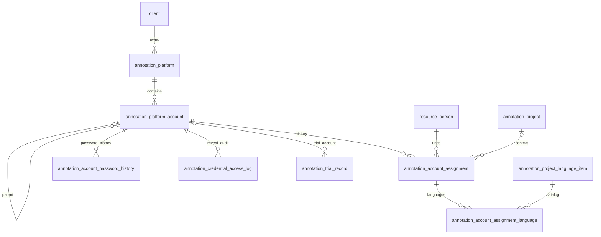

# 标注账号资产库数据库设计

## 1. 文档目的

本文描述标注平台和账号从项目级一次性数据重构为客户级长期资产的数据库设计、接口边界、迁移口径和明文凭据管理约束。实施日期为 2026-08-27，对应迁移文件：

- `data/migrations/20260827_annotation_account_library.sql`：建表、兼容列和权限补授。
- `tools/migrate_annotation_account_library.py`：业务数据搬迁与对账。
- `data/migrations/20260827_annotation_account_library_cleanup.sql`：验证后重命名旧表、删除兼容列。

迁移必须依次执行，清理脚本不得与前两步合并执行。

## 2. 核心业务决策

1. 平台归属于客户，不再归属于项目；同一客户的规范化 URL 只能登记一次。
2. 一条账号记录直接承载一组加密登录账号和密码，备用账号通过 `parent_account_id` 指向主账号。
3. 账号与标注员的关系是有起止日期的分配履历。一个账号同一时刻只允许一条未释放分配；允许先保存人员为空的项目上下文，稍后再分配标注员。
4. 语种属于账号当前的项目上下文或人员分配，不是账号的永久属性。
5. 标注员在人才资源库中通过“标注语言方向”维护可承接范围；该字段与标注项目详情复用同一份共享语种目录和相同的源语种/目标语种结构。单语/方言任务只填源语种，双语任务同时填写源语种和目标语种。
6. 同一标注员同一时刻只能占用一个有效账号；如需更换账号或项目，必须先释放原账号。语言方向用于记录该账号在项目中的适用语言范围，不改变人员的全局占用状态。
7. 账号允许以无凭据占位状态存在；只有 `registered` 状态强制要求账号和密码齐全。
6. 密码更新不覆盖历史。旧密文转入密码历史表，仍受原密钥版本保护。
7. 明文查看使用独立权限，每次成功查看都写数据库审计；应用日志仅作为辅助。
8. 账号动态字段为全局定义，试标和正式安排动态字段继续按项目隔离。

## 3. 关系概览

## 4. 新表

### 4.1 `annotation_platform`

客户级平台主表。

| 字段 | 类型 | 约束/说明 |
|---|---|---|
| `id` | UUID | 主键 |
| `client_id` | UUID | FK `client.id`，可空，删除受限 |
| `sub_client_id` | UUID | FK `sub_client.id`，可空，删除置空 |
| `origin_project_id` | UUID | 首次登记来源项目，仅追溯使用 |
| `platform_name` | VARCHAR(150) | 平台显示名 |
| `platform_url` | TEXT | 用户录入链接 |
| `platform_url_normalized` | TEXT | `_normalize_url` 规范化结果 |
| `login_notes` | TEXT | 验证码、二次验证和登录说明 |
| `is_active` | BOOLEAN | 是否启用 |
| `sequence_no` | INTEGER | 客户内展示顺序 |
| `created_by/created_at/updated_at` | 审计字段 | 创建人和时间 |

唯一索引 `uq_annotation_platform_client_url` 使用 `NULLS NOT DISTINCT`，确保未归属客户的同 URL 也不会重复。另有客户顺序索引和规范化 URL 聚合索引。

### 4.2 `annotation_platform_account`

| 字段 | 类型 | 约束/说明 |
|---|---|---|
| `platform_id` | UUID | FK 平台，级联删除 |
| `parent_account_id` | UUID | 备用账号指向主账号，删除置空，不得自指 |
| `nickname` | VARCHAR(255) | 业务昵称 |
| `login_account` | TEXT | 登录账号明文，可空 |
| `login_account_normalized` | TEXT | 去首尾空白并大小写折叠后的账号，用于平台内查重 |
| `password` | TEXT | 登录密码明文，可空 |
| `account_status` | VARCHAR(20) | `available/assigned/suspended/banned/retired` |
| `registration_status` | VARCHAR(30) | 沿用六种注册状态 |
| `account_source` | VARCHAR(30) | `client_provided/self_registered/annotator_owned` |
| `expires_on` | DATE | 到期日期 |
| `remarks` | TEXT | 备注 |
| `custom_values` | JSONB | 全局账号动态字段值 |
| `sequence_no` | INTEGER | 平台内顺序 |
| `password_updated_at` | TIMESTAMP | 当前密码生效时间 |

`UNIQUE(platform_id, login_account_normalized)` 是平台级查重的最终数据库防线。根据当前业务要求，普通列表接口直接返回并展示登录账号和密码明文。

### 4.3 `annotation_account_assignment`

记录账号由谁、在哪个项目、从何时开始使用以及何时释放。`person_id` 可空，用于账号已确定项目和适用语言、但尚未分配人员的场景；此时账号状态仍为 `available`。部分唯一索引 `uq_annotation_assignment_active` 约束每个账号最多一条 `released_on IS NULL` 的项目上下文或人员分配。释放日期不得早于分配日期，释放原因限定为项目完成、人员离职、账号封禁、重新分配和其他。

### 4.4 `annotation_account_assignment_language`

`assignment_id + language_item_id` 为复合主键。应用层必须验证语种属于该分配的项目；没有项目时不得填写语种。

### 4.5 `annotation_account_password_history`

保存被替换的明文 `password`、原生效时间、替换时间和修改人。历史密码不通过普通账号接口返回，也不提供通用查看接口。

### 4.6 `annotation_credential_access_log`

记录 `account_id`、查看用户、查看时间、原因和客户端 IP。只有成功读取完整凭据后才形成一条查看审计。

## 5. 现有表调整

### 5.1 `annotation_trial_record`

新增 `platform_account_id`，外键指向账号资产。迁移期间旧 `platform_member_id` 重命名为 `legacy_platform_member_id`，数据脚本完成映射后由清理脚本删除。

保存试标记录时同时验证：

- 账号存在当前未释放分配；
- 当前分配人员等于试标人员；
- 平台客户与试标项目客户一致。

### 5.2 `annotation_custom_field_definition`

作用域规则调整为：`project/account` 必须全局，`trial/assignment` 必须指定项目。迁移脚本按 `field_key` 合并存量账号字段定义，并把成员 `custom_values` 中的旧字段 UUID 映射到保留定义。

### 5.3 旧表生命周期

以下表在核对后重命名为 `_legacy`，保留一个版本周期，不立即物理删除：

- `annotation_project_platform`
- `annotation_platform_member`
- `annotation_platform_member_language`
- `annotation_platform_credential`

## 6. 查询与权限

账号列表和总数共用 `_account_query`，支持客户、平台、项目、人员、分配状态、账号状态、注册状态、语种及关键字。分页只在数据库查询完成后执行，前端不得再按 500 条全量拉取后筛选。

权限组为：

- `annotation_accounts:read`：平台、账号、统计和履历只读。
- `annotation_accounts:write`：平台、账号、分配与释放。
- 账号明文随账号列表直接返回，不再设置独立的查看权限。

## 7. 数据迁移口径

1. 旧平台与项目联表取得客户，按 `(client_id, normalized_url)` 合并；首条记录 UUID 作为新平台 UUID。
2. 主凭据、备用凭据分别生成账号；无凭据成员使用成员 UUID 生成占位账号。
3. 旧凭据解密后按平台和规范化账号查重，只保留最早账号，报告完整列出冲突。
4. 成员人员关系生成分配。冲突账号只保留最新成员为 active，其余补释放日期和 `reassigned`。
5. 成员语种迁入其分配语种表；试标记录映射至成员主账号。
6. 有 active 分配的账号回填 `assigned`；无 active 且旧注册状态为 disabled 的账号回填 `retired`；其余为 `available`。
7. 脚本输出新旧表行数、合并数、占位数、冲突清单、试标映射数和警告。旧库密文无法解密时必须人工处理后再运行 cleanup；新账号库不再依赖加密密钥。

## 8. 明文凭据管理约束

1. 数据库中的账号和密码按业务决定使用明文存储，不要求配置凭据加密密钥。
2. 普通列表接口直接返回登录账号和密码明文，不要求独立的 reveal 权限。
3. 兼容保留的显式凭据读取接口仍写入访问审计；普通列表读取不再单独生成逐账号审计。
4. 应通过数据库账号权限、备份访问权限和日志脱敏限制凭据的非业务访问。
5. 旧版密文迁入本账号库时仍需临时提供原密钥完成一次性解密，迁移完成后运行时不再依赖密钥。

## 9. 上线验收

- DDL 可重复执行，数据脚本重跑不重复建记录。
- 对账报告无未处理解密警告，冲突清单得到业务确认。
- 列表与 count 在每组筛选条件下相同，分页无跨页重复。
- 同账号并发分配只能成功一次；释放后可以重新分配。
- 编辑昵称且密码留空不会改变密文；改密新增一条密码历史。
- 无 reveal 权限返回 403；有权限查看后审计表新增一行。
- cleanup 前完成备份，并验证试标账号引用全部映射。
