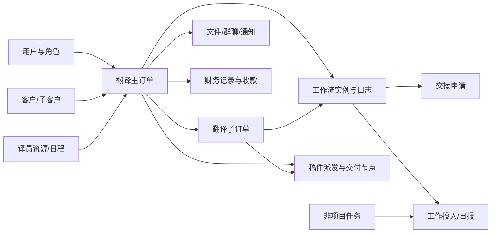

# 数据库整体设计

> 目标结构快照：2026-08-27 中国标准时间；来源：ORM 与 `20260827_annotation_account_library.sql`；schema：`public`。

## 1. 当前结论

- 完成账号资产库迁移后包含 **88 张业务表、1 个视图、208 条外键关系**。
- 标注账号旧表在清理阶段重命名为 `_legacy`，不计入上面的长期业务表数量。
- ORM 字段/约束检查：发现 **2 项差异**，详见第 8 节；实际运行约束以数据库为准。
- SQL 备份时效：根目录旧备份不包含本次账号资产库结构，不应作为迁移后的结构依据。
- 主键统一采用 UUID，并由 PostgreSQL `pgcrypto` 的 `gen_random_uuid()` 生成。
- 应用通过 SQLAlchemy + psycopg2 连接；连接池启用 `pool_pre_ping`；数据库会话时区设置为 `Asia/Hong_Kong`。
- 实际服务版本：`PostgreSQL 17.7 on x86_64-windows, compiled by msvc-19.44.35221, 64-bit`。

## 2. 结构来源与可信度

本次按以下优先级还原结构：

1. 当前 `.env` 指向的实际 PostgreSQL：字段、外键、唯一约束、CHECK、索引、视图和触发器。
2. `models.py`、`workflow_models.py`、`task_models.py`、`manuscript_models.py`：核对 ORM 映射和业务关系。
3. `data/migrations/`：确认近期权限、交接、日报、稿件安排等增量。
4. 根目录 `xinshi_system.sql`：仅用于识别较早的基线结构，不作为当前真相源。

## 3. 模块划分

| 模块 | 表数 | 表 |
|---|---:|---|
| 身份与权限 | 4 | `app_user`, `role`, `user_role`, `role_permission` |
| 客户与咨询 | 4 | `client`, `sub_client`, `client_contact`, `consultation` |
| 译员资源 | 2 | `translator`, `translator_schedule` |
| 项目与文件 | 3 | `translation_project`, `translation_sub_order`, `project_file` |
| 工作流与交接 | 5 | `workflow_instance`, `workflow_log`, `workflow_handover_request`, `workflow_handover_item`, `workflow_handover_attachment` |
| 协作与通知 | 6 | `chat_project_enabled`, `chat_project_message`, `chat_project_mention`, `chat_project_attachment`, `chat_project_message_attachment`, `app_notification` |
| 财务 | 2 | `finance_record`, `finance_payment` |
| 任务与日报 | 6 | `non_project_task_recurrence`, `non_project_task`, `non_project_task_event`, `work_entry`, `daily_report`, `daily_report_item` |
| 排班与请假 | 2 | `work_schedule`, `employee_leave` |
| 稿件安排 | 3 | `manuscript_dispatch`, `manuscript_arrangement`, `manuscript_delivery_milestone` |
| 标注运营 | 16 | `annotation_project`, `annotation_project_language_item`, `annotation_project_price_item`, `annotation_project_assignee`, `annotation_project_status_history`, `annotation_platform`, `annotation_platform_account`, `annotation_account_assignment`, `annotation_account_assignment_language`, `annotation_custom_field_image`, `annotation_account_assignment_image`, `annotation_account_password_history`, `annotation_credential_access_log`, `annotation_trial_record`, `annotation_assignee_rate`, `annotation_custom_field_definition` |
| 资源需求 | 3 | `resource_request`, `resource_request_item`, `resource_request_progress_log` |

## 4. 核心业务关系



完整字段级关系见 [er_diagram.drawio](./er_diagram.drawio)，图中拆为 4 个页面。

## 5. 关键关系说明

### 5.1 客户—项目—财务

- `client` 1:N `translation_project`，删除被项目使用的客户会被 `RESTRICT` 阻止。
- `client` 1:N `sub_client`，子客户随母客户级联删除。
- `translation_project` 1:N `translation_sub_order`；主订单删除时子订单级联删除。
- `translation_project` 1:0..1 `finance_record`；`finance_record.project_id` 唯一。
- `finance_record` 1:N `finance_payment`；同一财务记录的 `(stage_type, stage_no)` 唯一。

### 5.2 项目—工作流

- 每个 `workflow_instance` 必须且只能关联主订单或子订单之一，由 XOR CHECK 约束保证。
- 主订单和子订单分别通过唯一索引保证最多一个工作流实例。
- `workflow_log` 保存阶段前后值、操作人、下一处理人和说明，是主要审计轨迹。
- 交接申请通过 `workflow_handover_item` 一次包含多个工作流实例，并可复用项目聊天附件。

### 5.3 项目协作

- 每个项目最多一条 `chat_project_enabled` 设置。
- 消息、提及、附件采用实体表 + 关联表设计；删除消息会级联删除提及和消息附件关联，但附件实体可继续被交接使用。
- `app_notification` 随接收用户级联删除；关联项目删除时仅将项目引用置空。

### 5.4 任务—工时—日报

- 周期模板生成 `non_project_task`；模板删除时已生成任务保留，并将模板引用置空。
- `work_entry` 必须且只能关联一个工作流实例或一个非项目任务。
- `daily_report` 按 `(user_id, report_date)` 唯一；`daily_report_item` 是定稿时的展示快照。

### 5.5 稿件派发

- `manuscript_dispatch` 表示一次主订单/子订单派发批次。
- `manuscript_arrangement` 表示批次内单个译员的安排，保存订单、项目、译员和邮件投递快照。
- `manuscript_delivery_milestone` 通过 `(arrangement_id, sequence_no)` 保证节点顺序唯一。

## 6. 数据库级规则

- 删除策略以业务语义区分：明细和关联表多为 `CASCADE`，历史记录引用人员多为 `SET NULL`，关键业务主体多为 `RESTRICT`。
- 财务金额均使用定点 `numeric`，并有非负 CHECK；收款确认人和确认时间必须同时为空或同时存在。
- 状态字段在日报、任务、财务、稿件等新模块中使用 CHECK 限制允许值；较早的项目/咨询状态仍主要由应用层约束。
- `finance_record`、`finance_payment` 使用 `set_updated_at()` 触发器自动刷新 `updated_at`。
- `v_finance_record_display` 连接财务记录、项目与客户，为财务列表提供去外键化展示。

## 7. JSONB 使用点

| 表.字段 | 用途 |
|---|---|
| `app_user.fixed_tasks` | 用户固定任务配置 |
| `workflow_instance.stage_notes/stage_data` | 各工作流阶段备注和扩展数据 |
| `chat_project_message.content_json/metadata` | 富文本消息和消息元数据 |
| `workflow_handover_request.content_json` | 富文本交接说明 |
| `non_project_task_recurrence.weekdays` | 周期模板执行日 |
| `non_project_task_event.detail` | 状态事件详情 |
| `daily_report_item.display_metadata` | 日报展示快照 |
| `translator.domain_skills` | 译员领域技能 |
| `work_schedule.*_table/leave_notes/dept_person_data/not_scheduled_tasks` | 每日排班聚合快照 |

## 8. ORM 与实际库差异

| 表 | 差异类型 | 详情 |
|---|---|---|
| `recruitment_resume_source` | 仅数据库声明唯一 | (`None`) |
| `recruitment_resume_source` | 仅 ORM 声明唯一 | () |

这类差异不代表数据已经损坏，但会让开发期校验、自动建表和生产库行为不完全一致。建议以正式迁移脚本统一两侧定义。

## 9. 已识别的维护风险

1. `database.py` 存在默认明文数据库口令。应删除代码内默认口令，强制从环境变量或密钥管理读取，并轮换当前口令。
2. `.env.example` 的中文注释当前出现编码异常，建议统一保存为 UTF-8。
3. `work_schedule.updated_by`、`employee_leave.employee_id` 是 UUID，但当前数据库和 ORM 都没有外键；可能产生孤儿引用。
4. `manuscript_arrangement` 有 `entity_type` 状态检查，但缺少“主订单/子订单二选一”的跨字段 CHECK；其一致性目前依赖应用层。
5. 多处时间字段是无时区 `timestamp`。虽然连接会话固定香港时区，跨时区集成时仍应约定统一解释方式。
6. 根目录 SQL 备份明显早于当前迁移。恢复演练应使用新 `pg_dump`，并验证迁移脚本可重复执行。

## 10. 文档更新方法

数据库结构变化后，在项目根目录执行：

```powershell
python tools/generate_database_docs.py
```

脚本只读取数据库元数据，不读取业务行数据，也不会把口令或连接串写入文档。
