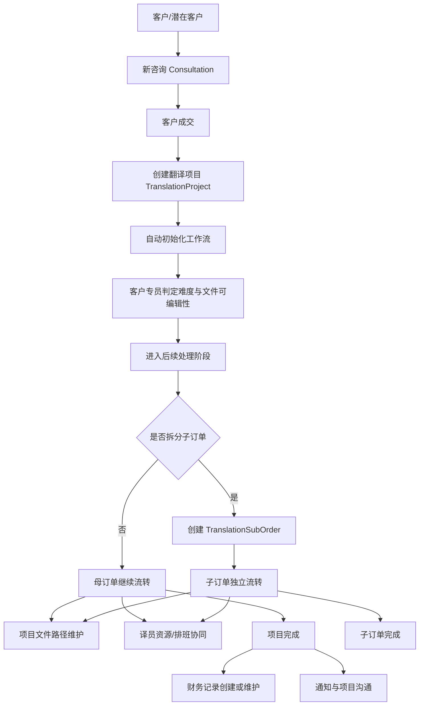
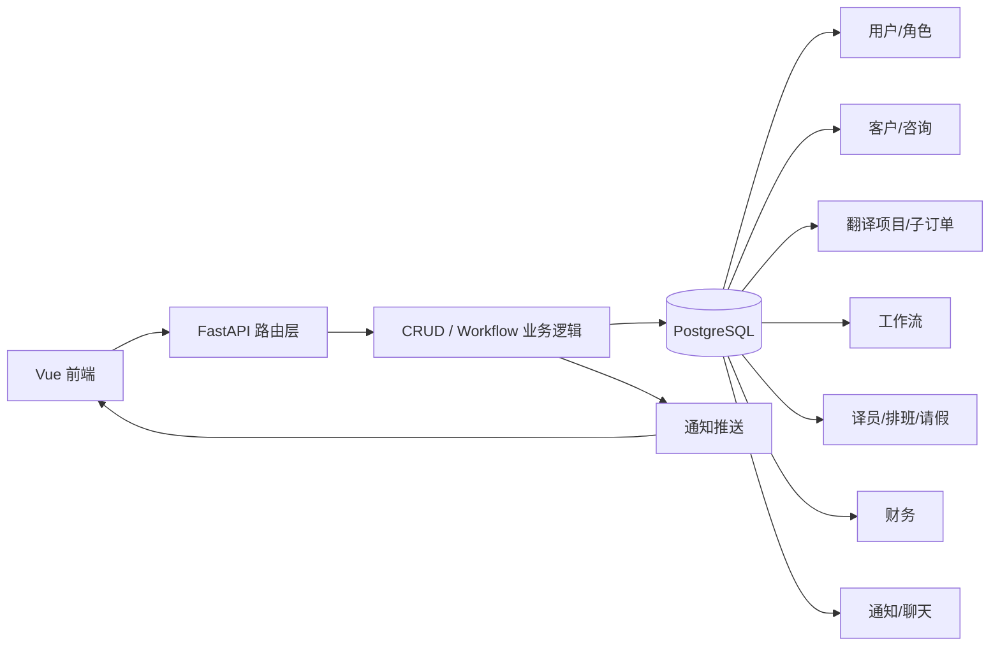

# 信实系统项目业务与逻辑框架分析

## 1. 项目一句话结论

这个项目本质上是一个**以翻译订单为核心的内部业务协同平台**。  
当前真正落地的主线不是“泛企业管理”，而是围绕**客户咨询 -> 翻译项目立项 -> 工作流流转 -> 子订单拆分 -> 译员资源与排班 -> 文件交付 -> 财务跟踪 -> 通知协同**这一条业务闭环展开。

从代码落地情况看，它更准确的定位应当是：

> **翻译公司项目运营管理系统**


## 2. 当前项目的真实业务边界

### 2.1 已落地的核心业务

当前后端和前端都已经形成闭环的模块主要有：

1. **认证与权限**
   - 用户登录
   - 用户管理
   - 角色管理
   - 用户角色关联

2. **客户侧业务**
   - 客户信息
   - 子公司客户信息
   - 客户联系人及回访
   - 新咨询管理
   - 咨询成功后创建翻译项目

3. **翻译项目主线**
   - 翻译项目创建、查询、编辑、删除
   - 主订单自动生成订单号
   - 子订单拆分与独立流转
   - 项目详情管理
   - 项目文件路径管理
   - 项目流程工作台

4. **流程协同**
   - 工作流初始化
   - 难度判定
   - 按阶段推进
   - 打回
   - 当前待办查询
   - 操作日志记录

5. **资源与排班**
   - 译员档案管理
   - 译员可用性管理
   - Excel 导入译员档期
   - 每日排班
   - 员工请假
   - 我的工作台

6. **财务与交付后跟踪**
   - 项目财务主记录
   - 分阶段回款记录
   - 发票状态
   - 项目完成时自动兜底创建财务记录

7. **协同提醒**
   - 站内通知
   - WebSocket 实时通知
   - 项目沟通聊天
   - @提醒


### 2.2 前端有菜单，但当前更像预留/占位的模块

以下内容在前端路由和页面中存在，但从后端挂载路由和页面实现情况看，**大多还没有形成真正业务闭环**：

1. 口译项目管理
2. 标注项目管理
3. 招聘项目管理
4. 其他项目管理
5. 营销管理
6. 采购管理
7. 人力资源管理的大部分页面
8. 内部管理
9. 技术管理

这些模块的典型特征是：

- 页面里存在 `TODO`
- 数据多为前端本地占位
- `main.py` 中没有对应后端路由挂载
- 还没有形成完整的数据模型和服务层

所以，**不要被菜单误导**。当前项目的业务重心非常明确，就是翻译项目运营主线。


## 3. 核心业务对象

### 3.1 人员与权限

| 对象 | 作用 |
| --- | --- |
| `AppUser` | 系统用户，代表内部员工 |
| `Role` | 角色定义 |
| `UserRole` | 用户与角色的多对多关联 |

这套结构决定了谁可以登录、谁能看菜单、谁可以承接某个流程阶段。


### 3.2 客户与商机

| 对象 | 作用 |
| --- | --- |
| `Client` | 正式客户主档 |
| `SubClient` | 子公司/子客户 |
| `ClientContact` | 客户拜访、回访、联系记录 |
| `Consultation` | 新咨询/新商机，属于项目前置阶段 |

业务上它们对应的是：

- 客户基础资料维护
- 咨询来源、方式、处理状态跟踪
- 咨询成交后转为翻译项目


### 3.3 译员与资源侧

| 对象 | 作用 |
| --- | --- |
| `Translator` | 译员档案、方向、质量、产能、是否可审校等 |
| `TranslatorSchedule` | 译员某天的可接稿时间段与来源 |
| `WorkSchedule` | 公司内部每日排班总表 |
| `EmployeeLeave` | 员工请假记录 |

这里体现出项目的资源管理逻辑：

- 译员资源是独立维护的
- 译员档期与内部员工排班是两套数据
- 请假会影响工作流指派


### 3.4 订单与项目侧

| 对象 | 作用 |
| --- | --- |
| `TranslationProject` | 母订单，系统最核心业务对象 |
| `TranslationSubOrder` | 子订单，用于把母订单拆成多个独立处理单元 |
| `ProjectFile` | 项目文件路径记录，包含原文、派稿、译文、发客户路径 |

这里有两个很重要的业务判断：

1. **母订单是管理中心**
   - 财务记录绑定母订单
   - 项目聊天绑定母订单
   - 项目文件也绑定母订单

2. **子订单是执行单元**
   - 可以有自己的截止时间
   - 可以有自己的译员
   - 可以有自己的工作流实例
   - 适合并行拆分处理


### 3.5 流程与协同

| 对象 | 作用 |
| --- | --- |
| `WorkflowInstance` | 某个母订单或子订单当前处于哪个阶段、由谁处理 |
| `WorkflowLog` | 每一步推进、打回、备注、交接日志 |
| `AppNotification` | 站内通知 |
| `ChatProjectEnabled` / `ChatProjectMessage` / `ChatProjectMention` | 项目聊天配置、消息、@提醒 |


### 3.6 财务侧

| 对象 | 作用 |
| --- | --- |
| `FinanceRecord` | 一单一条财务主记录 |
| `FinancePayment` | 定金/中期款/尾款等回款明细 |


## 4. 主业务闭环

### 4.1 业务主链路




### 4.2 起点：咨询到项目

这个系统不是直接从“建项目”开始，也支持从“咨询”进入：

1. 记录咨询来源、方式、客户、跟进人
2. 当咨询状态为成交后
3. 可以从咨询直接创建翻译项目

这说明系统把**商机前置管理**也纳入了翻译项目链路，而不是只做纯生产执行。


### 4.3 核心：翻译项目创建即进入流程

翻译项目创建后，系统会自动做两件事：

1. 自动生成主订单号
   - 格式类似：`TP-YYMMDD-NNNN`

2. 自动初始化工作流
   - 初始阶段固定为 `reception`
   - 也就是“客户专员接单”阶段

这意味着项目对象不是静态档案，而是**天然带流程状态的业务单据**。


### 4.4 流程中枢：难度决定流程深度

这是项目最关键的业务设计之一。

系统不是所有项目都走同一条链路，而是先由客户专员判断：

- 难度：`simple / normal / complex`
- 文件是否可编辑：`file_editable`

然后动态决定后续要经过哪些岗位。

#### 固定阶段全集

| 阶段 key | 业务含义 | 默认角色 |
| --- | --- | --- |
| `reception` | 客户专员接单 | 客户专员 |
| `layout_assign` | 排版指派 | 排版专员 |
| `project_manager` | 项目经理 | 项目经理 |
| `project_specialist` | 项目专员 | 项目专员 |
| `project_assistant` | 项目助理 | 项目助理 |
| `review` | 译审 | 译审 |
| `special_qc` | 专检 | 项目专员 |
| `layout` | 排版 | 排版专员 |
| `completed` | 完成 | 无 |

#### 动态裁剪规则

1. **如果文件可编辑**
   - 跳过 `layout_assign`

2. **简单项目 `simple`**
   - 跳过 `project_manager`
   - 跳过 `project_specialist`
   - 跳过 `review`

3. **普通项目 `normal`**
   - 跳过 `review`

4. **复杂项目 `complex`**
   - 走完整链路

这说明系统设计并不是“状态字段+几个按钮”，而是一个**可裁剪工作流引擎**。


### 4.5 子订单逻辑

子订单是这个项目很重要的第二层设计。

它解决的不是“项目分类”，而是**母订单内部拆分执行**：

- 一个母订单可以拆多个子订单
- 子订单有独立编号
- 子订单可以独立指派译员
- 子订单可以独立设置截止时间
- 子订单拥有自己的工作流实例

这非常适合以下业务场景：

- 大项目拆分给不同译员并行处理
- 不同语种或不同文件包拆单
- 母订单统一对外，子订单内部并行执行

所以可以把它理解成：

> `TranslationProject` 负责对外业务归口，`TranslationSubOrder` 负责对内执行拆解


### 4.6 文件管理逻辑

项目文件不是上传二进制，而是管理**文件路径**。

记录的主要是：

- 原文路径 `storage_path`
- 派稿路径 `dispatch_path`
- 译文路径 `translation_path`
- 发客户路径 `client_delivery_path`

这说明系统假设公司内部已有共享盘、网盘或局域网文件系统，项目系统本身更偏向**路径索引与流程协同中心**，而不是内容存储中心。


### 4.7 资源调度逻辑

资源调度分两层：

1. **译员层**
   - 维护译员能力、语言方向、质量、产能
   - 支持按日期管理可接稿时间段
   - 支持 Excel 导入档期

2. **内部员工层**
   - 每天维护排班表
   - 记录请假
   - 工作流指派时会检查人员是否正在请假

因此，这个系统并不只是“项目状态流转”，它已经把**项目生产资源**和**内部人力安排**接进来了。


### 4.8 完成后的财务衔接

财务部分的设计很贴近业务单据：

- 一个项目对应一条 `FinanceRecord`
- 一条财务记录下面有多条 `FinancePayment`
- 回款分阶段管理：定金、中期款、尾款

另外有一条很关键的逻辑：

> 当母订单工作流走到完成时，系统会自动确保存在财务记录。

也就是说，财务不是完全独立模块，而是**项目完成后的自然延伸**。


## 5. 系统逻辑框架

### 5.1 后端逻辑分层

当前后端虽然没有严格拆成 service 层目录，但逻辑上已经形成以下结构：

```text
Router 层
  -> 接口参数、鉴权、HTTP 响应

CRUD / Workflow 业务层
  -> 业务规则
  -> 工作流推进
  -> 指派、通知、财务联动

Model 层
  -> SQLAlchemy ORM 数据模型

Database 层
  -> PostgreSQL 连接与 Session
```

其中：

- 常规增删改查主要集中在 `crud.py`
- 工作流专门放在 `workflow_crud.py`
- 路由集中在 `routers/`


### 5.2 前后端职责分工

#### 前端负责

- 登录态管理
- 菜单和路由控制
- 表单与流程操作界面
- 工作台与排班可视化
- 通知展示
- 项目聊天界面

#### 后端负责

- JWT 鉴权
- 业务数据持久化
- 角色与指派规则
- 工作流阶段推进与回滚
- 站内通知落库
- WebSocket 推送


### 5.3 技术框架

#### 后端

- FastAPI
- SQLAlchemy ORM
- PostgreSQL
- JWT 鉴权
- WebSocket 实时通知

#### 前端

- Vue 3
- Vue Router
- Element Plus
- Axios
- Vite


### 5.4 模块关系图




## 6. 权限与角色设计思路

从代码可以看出，权限并不是细粒度 RBAC 到按钮级，而是采用了**菜单权限 + 流程角色指派**的组合模式。

### 6.1 菜单权限

- 超级管理员/管理员拥有更完整菜单
- 普通业务角色默认能进入翻译主线相关页面
- 部分页面通过前端路由 `meta.roles` 做可见性控制

### 6.2 流程权限

流程真正的执行权限核心不在菜单，而在：

- 当前阶段负责人 `current_assignee_id`
- 当前阶段角色组 `group_assign_role`

待办查询会把以下任务给当前用户：

1. 明确指派给自己的任务
2. 指派给自己所属角色组的任务
3. 客户专员在接单阶段的特殊待办

也就是说，**页面能看到只是第一层，任务是否轮到你处理是第二层**。


## 7. 已落地模块与预留模块的关系判断

这个项目现在呈现出一个很典型的阶段性特征：

### 7.1 已经产品化的部分

- 翻译项目主流程
- 客户与咨询
- 译员资源
- 排班与请假
- 财务
- 通知与项目沟通

这些模块已经有：

- 数据模型
- 后端路由
- 前端页面
- 业务联动

### 7.2 仍处于扩展预留状态的部分

- 口译
- 标注
- 招聘
- 其他项目
- 营销
- 采购
- HR 大部分页面
- 行政/技术等辅助板块

这些更像是“未来要纳入统一平台”的版图，而不是当前系统的已成熟核心。


## 8. 对这个项目的结构化理解

如果用一句更工程化的话来描述这个仓库，可以这样理解：

> 它不是一个纯 CRUD 管理后台，而是一个以翻译订单为中心、带轻量工作流引擎、资源调度、通知协同和财务衔接能力的业务系统。

进一步拆开看，它由 4 个层次组成：

### 第 1 层：业务入口层

- 客户
- 咨询
- 翻译项目

### 第 2 层：生产执行层

- 工作流
- 子订单
- 文件路径
- 译员资源
- 排班/请假

### 第 3 层：协同沟通层

- 我的工作台
- 站内通知
- 项目聊天

### 第 4 层：经营收口层

- 财务记录
- 回款阶段
- 发票状态


## 9. 结论

### 9.1 基本业务结论

该项目的核心业务不是泛 OA，也不是完整 ERP，而是：

**翻译业务项目化运营管理**

它把翻译公司的实际工作拆成了：

- 商机获取
- 项目立项
- 流程执行
- 资源协调
- 交付协同
- 财务收口


### 9.2 逻辑框架结论

它的逻辑主轴是：

**订单驱动 + 流程驱动 + 角色驱动 + 资源协同驱动**

其中：

- `TranslationProject` 是中心单据
- `WorkflowInstance` 是推进引擎
- `TranslationSubOrder` 是执行拆分单元
- `Translator / WorkSchedule / EmployeeLeave` 是资源层
- `FinanceRecord` 是收口层
- `Notification / ProjectChat` 是协同层


## 10. 本次分析主要依据

本分析主要基于以下代码结构归纳，不依赖数据库中的实际业务数据：

- `main.py`
- `models.py`
- `workflow_models.py`
- `workflow_crud.py`
- `crud.py`
- `routers/*.py`
- `frontend/src/router/index.js`
- `frontend/src/views/project/translation/*`
- `frontend/src/views/schedule/*`
- `frontend/src/views/finance/*`
- `frontend/src/components/NotificationBell.vue`
- `frontend/src/components/ProjectChatPanel.vue`

